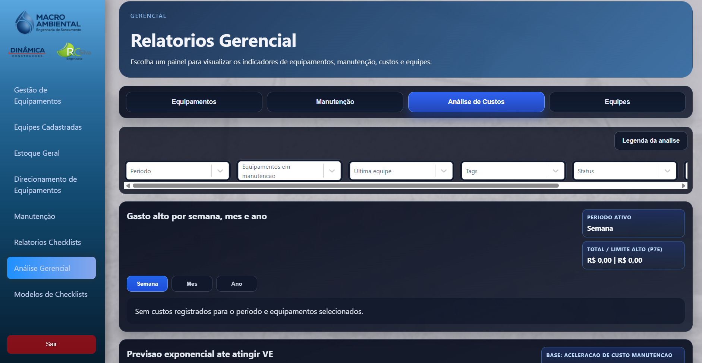
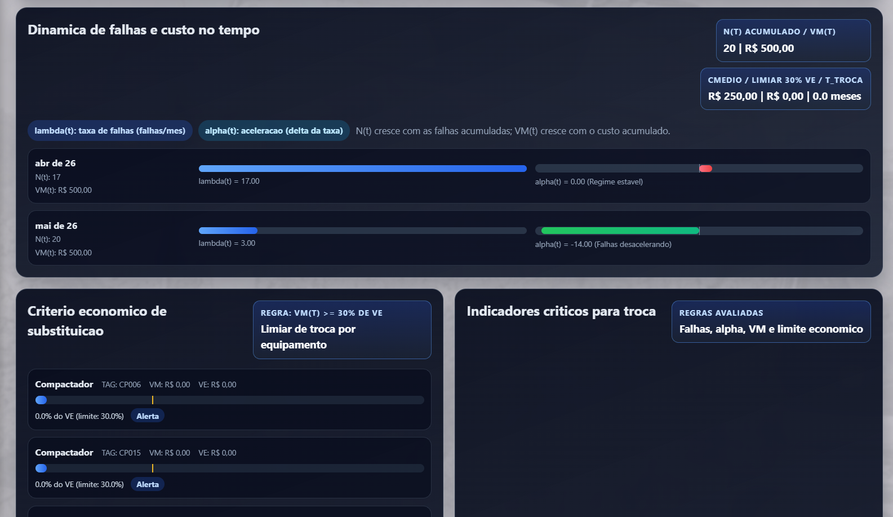
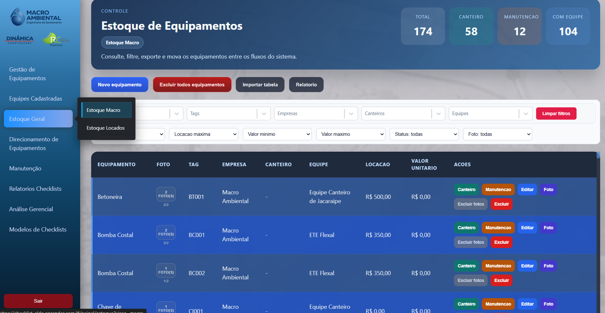
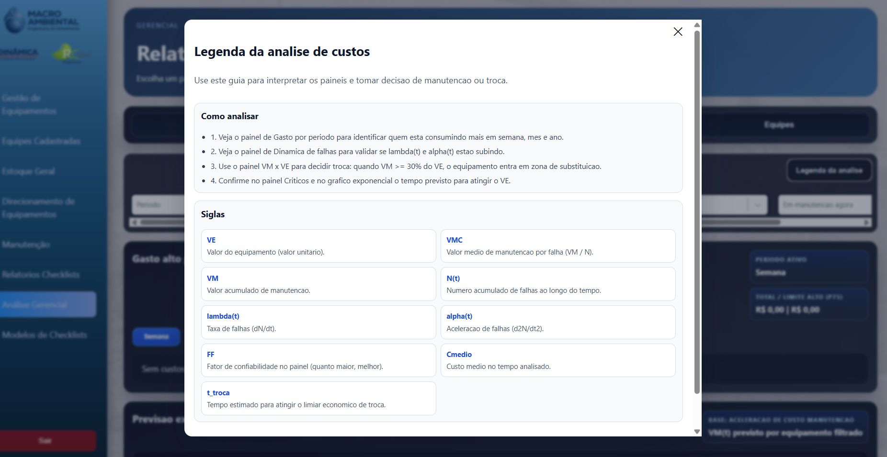
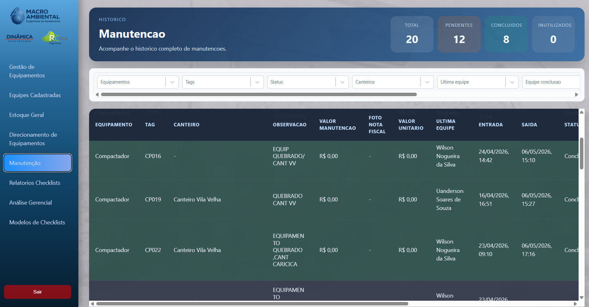
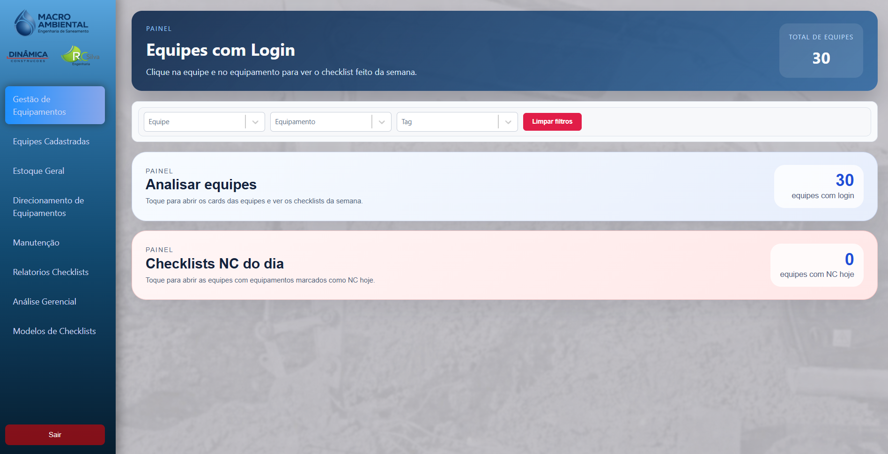
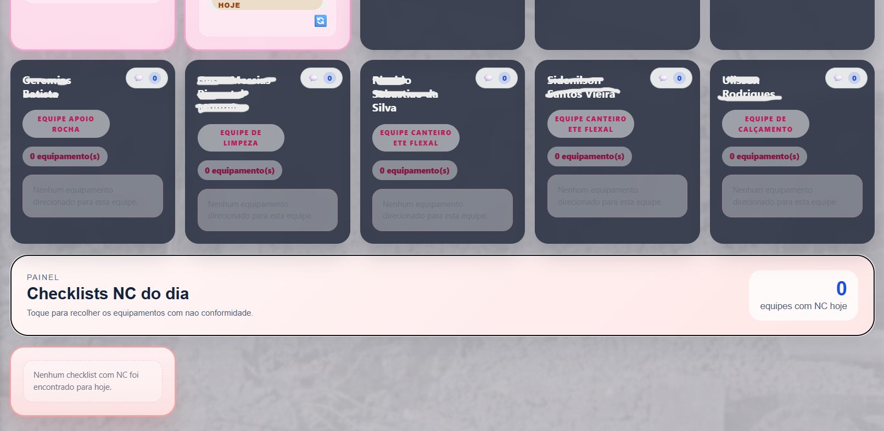
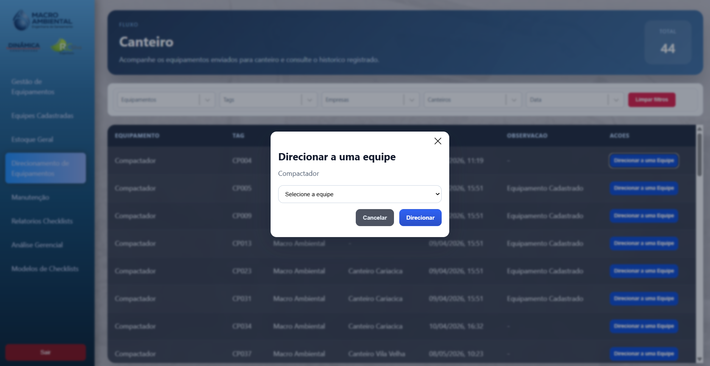

# Sistema de Equipamentos

## Descrição

Este repositório contém a documentação e imagens do Sistema de Equipamentos, uma plataforma desenvolvida para gerenciar e analisar equipamentos em diversos contextos. O sistema inclui funcionalidades para controle de estoque, manutenção preventiva, análise gerencial e direcionamento estratégico.

## Funcionalidades Principais

- **Controle de Estoque**: Gerenciamento eficiente do inventário de equipamentos.
- **Manutenção**: Sistema de manutenção preventiva e corretiva.
- **Análise Gerencial**: Análises avançadas para tomada de decisões estratégicas.
- **Painel de Controle**: Interface visual para monitoramento e operação.

## Análise Gerencial

A parte de análise gerencial do sistema foi desenvolvida por **Ester Soares Serafim** através de cálculos matemáticos rigorosos. Esses cálculos foram validados por engenheiros especializados da **Macro Ambiental**, garantindo a precisão e confiabilidade das análises realizadas.

### Imagens Relacionadas

- 
- 
- 
- 
- 
- 
- 
- 

## Contribuição

Para contribuir com o projeto, entre em contato com a equipe responsável.

## Licença

Este projeto está sob a licença [especificar licença, se aplicável].
